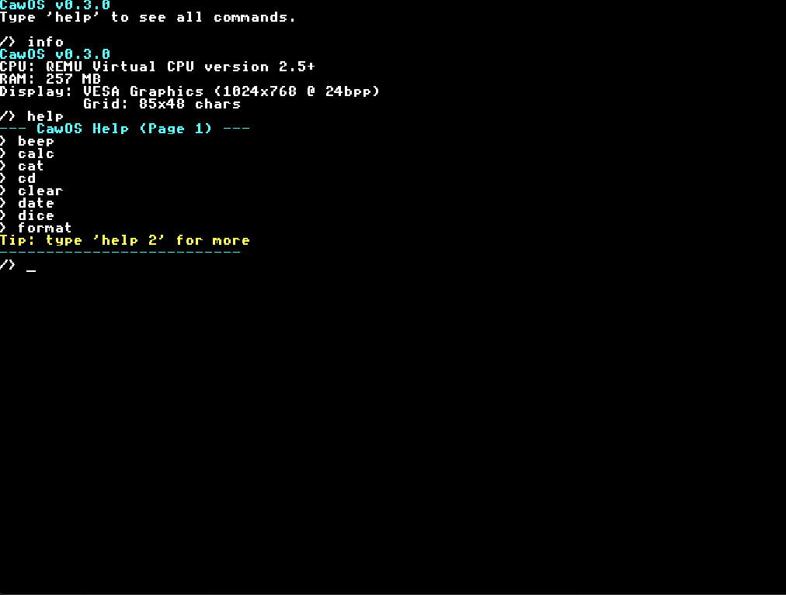

# CawOS v0.3.0

**CawOS** - это многофункциональная 32-битная операционная система для архитектуры x86 (i686), разработанная с нуля на C и Assembly. Проект оснащен собственным микроядром, расширяемой файловой системой, полноценной графической оконной оболочкой (GUI Desktop), встроенными драйверами (включая звук AC97 и мышь PS/2), а также диагностическим режимом восстановления.

---

## Ключевые возможности и архитектура

### Ядро и низкоуровневая система
- **32-битный Protected Mode**: Загрузка через двухэтапный загрузчик (MBR -> Stage 2), инициализация сегментации через GDT и запуск ядра по адресу `0x100000`.
- **Interrupt Descriptor Table (IDT)**: Настройка исключений процессора, аппаратных прерываний (PIC 8259 remapping) и системных вызовов.
- **Watchdog Timer**: Встроенный сторожевой таймер в обработчике прерывания системного таймера (100Hz) для обнаружения и предотвращения зависаний ядра.
- **Blue Screen of Death (BSOD)**: Вывод детального дампа регистров процессора (`EIP`, `EAX`, `EBX`, `ECX`, `EDX`, `ESP`, `EBP`, `CS`) при возникновении критических исключений (Divide by Zero, Page Fault, GPF).
- **Раздельный стек системных вызовов**: Системные вызовы (`int 0x80`) выполняются на выделенном ядерном стеке размером 16 КБ (`syscall_kstack`), предотвращая переполнение стека пользовательского приложения.
- **Интерфейс системных вызовов**: Поддержка 10 системных вызовов (`sys_exit`, `sys_putchar`, `sys_print`, `sys_clear`, `sys_setcursor`, `sys_getkey`, `sys_open`, `sys_read`, `sys_write`, `sys_close`) для взаимодействия пользовательских программ с ОС.

### Графическая подсистема и GUI
- **Драйвер VBE (VESA Bios Extensions)**: Поддержка графических режимов высокого разрешения (например, 1024x768) с глубиной цвета 16, 24 и 32 BPP.
- **Двойная буферизация**: Отрисовка кадров в теневой буфер в оперативной памяти (`g_shadow`) с последующим копированием в видеобуфер (`g_framebuffer`) для устранения мерцания (tearing).
- **GUI Desktop (Оконный менеджер)**:
  - Запускается командой `gfx` из консоли.
  - Полноценная поддержка окон с заголовками, рамками, фокусом ввода и кнопкой закрытия.
  - Поддержка перемещения окон перетаскиванием (drag-and-drop) мышью.
  - Панель задач (Taskbar) с кнопкой «Пуск» и статус-панелью.
  - Отрисовка прямоугольника выделения на рабочем столе мышью.
  - **Встроенные графические приложения**:
    - `CawPad Text Editor (notepad)` - многострочный текстовый редактор с кареткой, вводом текста и обработкой клавиши Backspace.
    - `About` - сведения о системе.
    - `Find` - поиск файлов/текста.
    - `Help` - справочное руководство GUI.
    - `List` - графический проводник по файлам.
    - `Run` - запуск исполняемых файлов.
- **Текстовый режим VGA**: Автоматический откат на классический VGA-режим (80x25 с цветовыми атрибутами символов), если графический режим VBE недоступен.

### Файловая система CawFS (кластерная)
- **Структура а-ля FAT**: Использование таблицы кластеров `cawfat` для динамического выделения памяти под файлы.
- **Параметры разметки** (описаны в `fs_config.h`):
  - Поддержка до **1024 файлов/каталогов** (`MAX_FILES`).
  - Объем диска до **32768 кластеров** (`MAX_CLUSTERS`).
  - Сигнатура разметки: `0xCA705`.
- **Поддержка папок**: Иерархическая структура каталогов с возможностью создания папок (`fs_mkdir`) и навигации по ним (`fs_cd`).
- **Спецификация ввода-вывода**:
  - Использование прямого драйвера **ATA/IDE PIO** при наличии совместимого контроллера.
  - Откат на BIOS прерывания (через переключение Real-to-Protected mode thunk) для записи/чтения секторов диска.
  - Поддержка постоянного хранения данных (Persistent storage) между перезагрузками.

### Драйверы периферии
- **AC97 Audio Driver**: Полноценный драйвер звуковой карты AC97, сканирующий шину PCI (класс `0x04` подкласс `0x01`). Выполняет настройку Bus Mastering через I/O-порты NABM/NAM и проигрывает сырые PCM звуки. При запуске автоматически проигрывает файл `boot_sound_cawos`.
- **PC Speaker**: Программная генерация звуковых сигналов через системный PIT (таймер 8253/8254).
- **PS/2 Mouse Driver**: Драйвер мыши с аппаратным сбросом контроллера PS/2, обработкой 3-байтовых пакетов движения (с учетом знакового расширения delta-X/Y и кнопок) и ограничением перемещения границами экрана.
- **Keyboard Driver**: Поддержка прерываний клавиатуры (IRQ 1), обработка скан-кодов, поддержка Shift, Caps Lock и Ctrl+C.
- **ACPI Driver**: Парсинг системных таблиц ACPI (`RSDP`, `RSDT`, `XSDT`, `FADT`, `MADT`). Позволяет определять количество процессоров в системе, находить базовые адреса Local/IO APIC, переопределять IRQ (Interrupt Override) и выполнять корректное выключение компьютера (`acpi_shutdown`).
- **CMOS RTC Driver**: Чтение реального времени и даты непосредственно из CMOS-памяти.

### Пользовательское ПО и ELF-загрузчик
- **ELF Loader**: Загрузчик исполняемых файлов формата ELF (32-bit Executable, i386, PT_LOAD-сегменты, инициализация области BSS).
- **Пользовательские ELF-программы** (в папке `src/bin`):
  - `fileview.elf` - просмотр файлов через системные вызовы.
  - `keytest.elf` - интерактивный тест кодов клавиш.
  - `guess_game.elf` - текстовая игра «Угадай число».

### Режим диагностики (Recovery Console)
- Доступен при нажатии клавиши **Delete (`DEL`)** в первые 500 мс загрузки системы.
- Независимый бинарный модуль восстановления (`recovery.bin`), загружаемый на физический адрес `0x100000`.
- Осуществляет автоматическую диагностику оперативной памяти в диапазоне `0x500000 - 0x900000` (запись и валидация паттернов `0x55555555` и `0xAAAAAAAA`).
- Выводит результаты тестирования на красивый синий графический экран диагностики.

---

## Сборка и Запуск

### Требования к окружению
Для успешной компиляции и запуска вам понадобятся:
1. Кросс-компилятор **`i686-elf-gcc`** (и соответствующие утилиты `i686-elf-ld`, `i686-elf-objcopy`).
2. Ассемблер **`nasm`**.
3. **`Python 3`** для выполнения скриптов упаковки диска.
4. Эмулятор **`QEMU`** (с настроенной эмуляцией звуковой карты `ac97`).

### Инструкция по сборке пользовательского ПО
Перед общей сборкой образа рекомендуется скомпилировать пользовательские ELF-приложения:
```bash
cd include
compile_programs.bat
```

### Инструкция по сборке и запуску ядра
Для сборки ядра, создания CawFS-структуры диска и запуска выполните:
```bash
build.bat   # Компилирует исходные коды ядра и собирает CawOS.img (16 МБ)
start.bat   # Запускает образ в QEMU с конфигурацией аудио ac97
```

---

## Скриншоты работы системы


*Экран загрузки системы с ASCII-арт логотипом*


*Интерактивная командная оболочка консольного режима*
