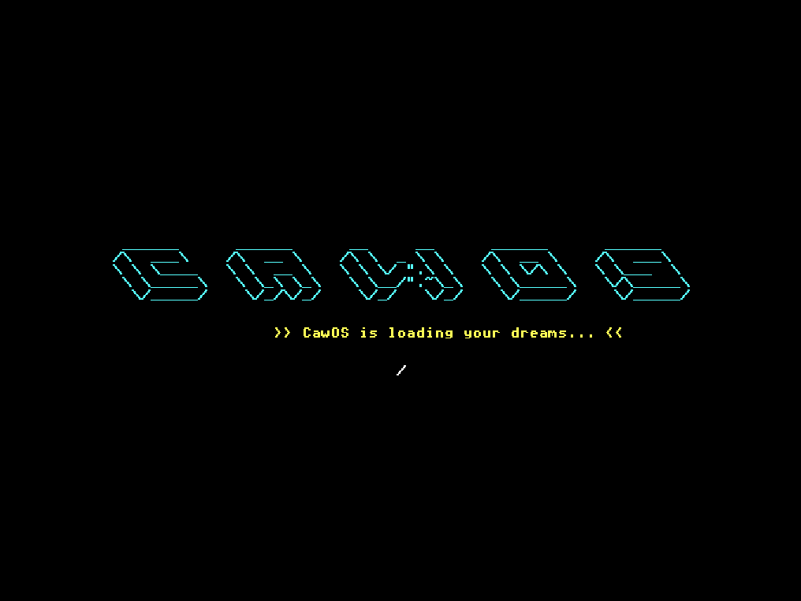

# 🐧 CawOS v0.2.2

**CawOS** — самодельная 32-битная операционная система, написанная с нуля на C и Assembly. Полностью bootable OS с собственным ядром, файловой системой и командной оболочкой.

## ✨ Ключевые возможности

### Ядро и архитектура
- **32-битное x86 ядро** в Protected Mode с полной настройкой GDT
- **IDT (Interrupt Descriptor Table)** с обработкой исключений и hardware interrupts
- **Blue Screen of Death (BSOD)** с дампом регистров при критических ошибках
- **Watchdog timer** для предотвращения зависаний системы
- **PIC (8259)** remapping для корректной обработки IRQ

### Файловая система (CawFS)
- Собственная файловая система на базе ATA PIO
- Поддержка до 24 файлов с метаданными
- Прямая работа с диском через BIOS interrupts (INT 13h)
- Persistent storage — данные сохраняются между перезагрузками
- LBA адресация для работы с секторами диска

### Драйверы
- **ATA/IDE driver** — чтение/запись секторов через PIO режим
- **VGA text mode** (80x25) с поддержкой цветов
- **PC Speaker** — генерация звуковых сигналов
- **Keyboard** — полная раскладка с обработкой скан-кодов
- **System timer** (PIT 8253) на частоте 100Hz

### Графика
- ASCII-арт логотип при загрузке
- Цветной текстовый вывод с управлением курсором
- Поддержка VGA палитры (16 цветов)

## 🛠 Сборка и запуск

### Требования
- `i686-elf-gcc` (кросс-компилятор для x86)
- `nasm` (ассемблер)
- `QEMU` (для эмуляции)
- Python 3 (для скриптов сборки)

### Команды
```bash
build.bat   # Компиляция ядра и создание образа диска
start.bat   # Запуск в QEMU
```

## 🏗 Архитектура проекта

### Bootloader
- Загрузка с MBR (512 байт)
- Включение A20 gate
- Переход в Protected Mode
- Загрузка ядра с диска в память (0x1000)

### Kernel
- Инициализация IDT и GDT
- Настройка файловой системы
- Запуск командной оболочки
- Основной цикл обработки клавиатуры

### Система команд
Модульная архитектура с макросом `REGISTER_COMMAND` — команды автоматически регистрируются в специальной секции `.cmd` через linker script.

## 📸 Скриншоты



## 🔧 Технические детали
- **Язык**: C (kernel/drivers) + x86 Assembly (boot/low-level)
- **Архитектура**: i686 (32-bit x86)
- **Размер образа**: ~1.44MB (floppy disk image)
- **Формат**: Raw binary bootable image
- **Файловая система**: Custom CawFS с magic number 0xCA705
