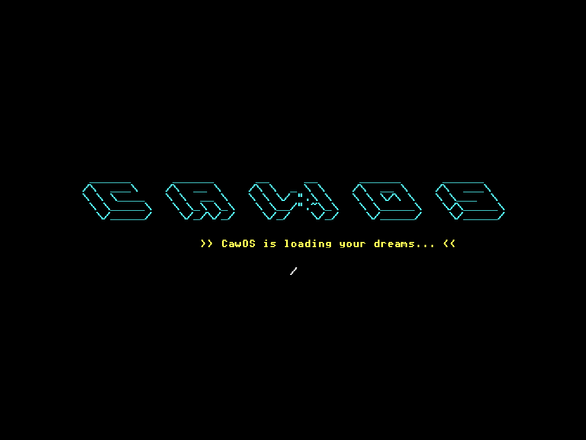
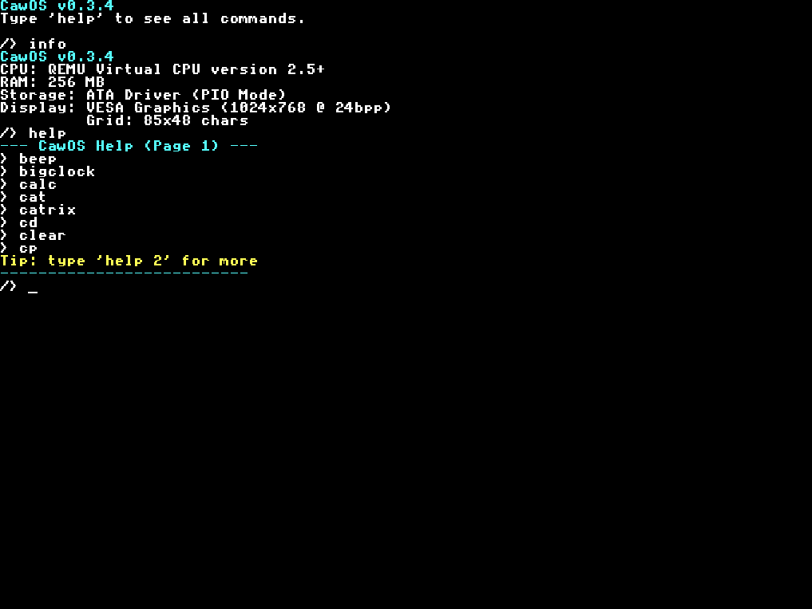

# CawOS v0.3.4

**CawOS** - это многофункциональная 32-битная операционная система для архитектуры x86 (i686), написанная с нуля на C и Assembly. Проект включает собственный двухэтапный загрузчик, ядро с вытесняющей многозадачностью и Ring-3 процессами, файловую систему CawFS, графическую оболочку (GUI Desktop), набор драйверов (ATA, AC97, PS/2-мышь, ACPI и др.) и режим диагностики (Recovery).


## Возможности

### Загрузка и низкоуровневый слой
- **Двухэтапный загрузчик**: `boot.asm` (MBR, чтение через INT 13h AH=42h EDD) → `stage2.asm` (0x8000): включение A20 (порт 0x92), инициализация VBE, загрузка ядра по LBA, переключение в защищённый режим через собственную GDT, копирование ядра на 0x100000 и передача управления `kernel_entry.asm`.
- **VBE-графика при загрузке**: загрузчик перебирает список режимов (приоритет - 1024×768, затем 800×600 и 640×480, глубина 16/24/32 bpp, только с линейным фреймбуфером). Если ни один режим недоступен - откат в текстовый режим VGA 80×25 (0xB8000).
- **GDT + TSS**: TSS используется для стеков ESP0 при переходах Ring 3 → Ring 0.
- **IDT и прерывания**: обработчики исключений (Divide by Zero, GPF, Page Fault), remap PIC 8259, таймер 100 Гц, IRQ1 (клавиатура), IRQ12 (мышь), программное прерывание `int 0x80` для системных вызовов.
- **Куча ядра**: самонастройка - память прощупывается паттернами (`wbinvd`) от 0x00800000 вверх с шагом 1 МиБ; `malloc`/`free` со списком свободных блоков.

### Планировщик и процессы
- **Вытесняющий round-robin**: переключение контекста по таймеру (квант - 5 тиков при 100 Гц), таблица на 16 процессов (состояния RUNNING/READY/ZOMBIE), "сбор зомби".
- **Ring-3 процессы**: пользовательские ELF-программы исполняются в третьем кольце защиты с отдельным пользовательским стеком; ядро получает управление через TSS.
- **ELF-загрузчик**: 32-bit ELF (i386, ET_EXEC, PT_LOAD-сегменты, обнуление BSS). Программы линкуются на `-Ttext=0x1000000`.
- **Системные вызовы** (`int 0x80`, 12 штук): `sys_exit`, `sys_putchar`, `sys_print`, `sys_clear`, `sys_setcursor`, `sys_getkey`, `sys_open`, `sys_read`, `sys_write`, `sys_close`, `sys_yield`, `sys_getpid` (номера 1–12, см. `include/kernel/syscall.h`).
- **Консольное управление процессами**: `run` (запуск с ожиданием завершения), `spawn` (фоновый запуск), `ps`, `kill`.

### Графика и GUI
- **Двойная буферизация**: кадр рисуется в теневой буфер `g_shadow`, затем копируется во фреймбуфер - без мерцания.
- **Масштабируемый шрифт**: растровый шрифт 8×8 с масштабированием (`font small | normal | large`), отрисовка текста и в графическом, и в текстовом режиме.
- **GUI Desktop** (команда `gfx`):
  - панель задач с кнопкой "Пуск" и меню (Programs, Documents, Settings, Find, Help, Run..., Shut Down...);
  - окна с заголовком, фокусом, кнопкой закрытия и перемещением перетаскиванием мышью;
  - прямоугольник выделения на рабочем столе;
  - встроенные графические приложения: `about`, `help`, `find`, `list`, `notepad`, `run`.
- **Idle-режим**: после 60 секунд бездействия (настраивается, вкл/выкл - `idle`) показываются большие часы (`bigclock`).

### Файловая система CawFS
- Табличная ФС "а-ля FAT": 1024 файла/каталога, до 32768 кластеров по 512 байт, сигнатура 0xCA705.
- Иерархические каталоги (`mkdir`, `cd`, `ls` с пагинацией), атрибуты файлов (размер, исполняемость).
- Параметры разметки генерируются сборкой в `include/fs_config.h` (таблица ФС на LBA 979, CawFAT, данные с LBA 1259).
- **Два пути ввода-вывода**: драйвер ATA/IDE PIO (основной) и откат на BIOS INT 13h через Real↔Protected mode thunk (актуально для QEMU/старого железа). Данные сохраняются между перезагрузками.
- В CawFS хранятся и **настройки системы** (`/core/config`): флаг чистого выключения, режим сериальной консоли (`serial_console=1`), настройки idle-таймаута.

### Драйверы
- **ATA/IDE PIO** - чтение/запись секторов (primary/secondary, master/slave).
- **AC97** - поиск устройства на шине PCI (класс 0x04, подкласс 0x01), Bus Mastering через NAM/NABM, воспроизведение сырого PCM; при загрузке играет `boot_sound_cawos`.
- **PC Speaker** - `beep` через PIT.
- **PS/2 мышь** - IRQ12, 3-байтовые пакеты, знаковое расширение dX/dY, ограничение курсора экраном.
- **Клавиатура** - IRQ1, скан-коды, Shift/Caps Lock, Ctrl+C (прерывание "демо"-команд), Ctrl+L (очистка экрана).
- **ACPI** - поиск RSDP (EBDA + 0xE0000–0xFFFFF), разбор RSDT/XSDT, FADT, MADT: количество CPU, адреса Local/IO APIC; корректное выключение (`shutdown`, `gfx`).
- **CMOS RTC** - реальное время и дата (`date`).
- **COM1 (serial)** - журнал ядра (`LOG_INFO`/`LOG_ERROR`) и полноценная сериальная консоль.

### Диагностика: BSOD, Watchdog, Recovery
- **Blue Screen of Death**: при Divide by Zero, GPF, Page Fault и срабатывании watchdog выводится синий экран с дампом регистров (EIP, CS, EAX–EDX, ESP, EBP; CR2 для Page Fault) и stack trace по цепочке EBP (до 8 кадров). Дамп дублируется на COM1 (`[BSOD] ...`). Команда `panic` вызывает BSOD намеренно (для проверки).
- **Watchdog**: если ядро не сбрасывало счётчик дольше 5 секунд (500 тиков по 100 Гц) - BSOD "WATCHDOG TIMEOUT" и остановка.
- **Recovery Console**: удержание/нажатие **DEL в первые ~500 мс** загрузки загружает вместо ядра отдельный модуль `recovery.bin`, который тестирует ОЗУ в диапазоне `0x500000–0xB00000` паттернами `0x55555555`/`0xAAAAAAAA` и выводит результат на синий диагностический экран. Перезапуск - клавиша R.

### Оболочка (shell)
- Приглашение вида `/> ` (текущий каталог).
- История команд (стрелки вверх/вниз, 10 команд), автодополнение по Tab (если совпадение одно).
- **Сериальная консоль**: при `serial_console=1` в `/core/config/serial.cfg` вывод команд дублируется на COM1, а ввод с COM1 обрабатывается как обычная консоль (удобно для headless-запуска и автотестов).

---


## Сборка и запуск

### Требования
1. Кросс-компилятор **`i686-elf-gcc`** (+ `i686-elf-ld`, `i686-elf-objcopy`).
2. Ассемблер **`nasm`**.
3. **Python 3** (упаковка образа и ФС).
4. **QEMU** (`qemu-system-i386`).

### Linux / macOS
```bash
./build.sh    # полный конвейер: ELF-программы → ядро → recovery → CawOS.img (16 МиБ)
./run.sh      # запуск в QEMU (serial → stdio, AC97 audio)
```
Полезные опции `run.sh` (обёртка над `scripts/run.py`):
```bash
./run.sh --no-audio          # без звуковой карты
./run.sh --headless          # -nographic
./run.sh --timeout 20        # 20 секунд, журнал COM1 → serial.log
./run.sh --memory 256        # объём ОЗУ (МиБ)
```

### Windows
```bat
build.bat    :: сборка ядра, recovery и образа (пользовательские программы должны быть собраны заранее)
compile_programs.bat    :: компиляция fileview/keytest/guess_game в src\bin\elf
start.bat    :: запуск образа в QEMU (dsound + AC97)
```
> Основной (кроссплатформенный) путь сборки - `scripts/build.py` (его вызывает `build.sh`): он сам компилирует **все 5** ELF-программ, ядро, recovery, генерирует `fs_config.h` и собирает образ. `build.bat` - Windows-альтернатива.

### Прочие утилиты
- `scripts/unpack.py` (`unpack.bat`) - распаковка CawFS из готового образа в каталог `extracted/`.
- `scripts/font.py` (`font.bat`) - визуализация глифов шрифта `font8x8_basic` из `src/libc/font.c` в терминале.

---

## Отладка и сериальная консоль

Ядро всегда пишет журнал на COM1: этапы инициализации, версия, ошибки; при падении - дамп BSOD. В QEMU это удобно перехватывать:

```bash
./run.sh --timeout 20                    # serial.log будет записан
qemu-system-i386 -drive format=raw,file=CawOS.img,if=ide -serial stdio
```

Для интерактивной работы через COM1 включите в ОС зеркалирование вывода (файл `/core/config/serial.cfg` содержит `serial_console=1` - включено в поставляемом образе).


---


## Скриншоты


*Загрузочный экран с ASCII-логотипом*


*Командная оболочка*

---

## Лицензия

Проект распространяется по лицензии **Apache License 2.0** - см. [LICENSE](LICENSE).
